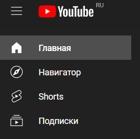
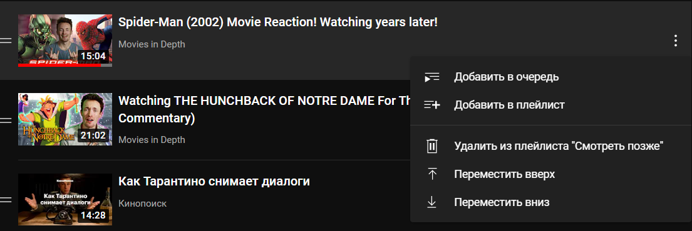
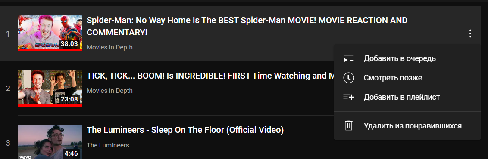
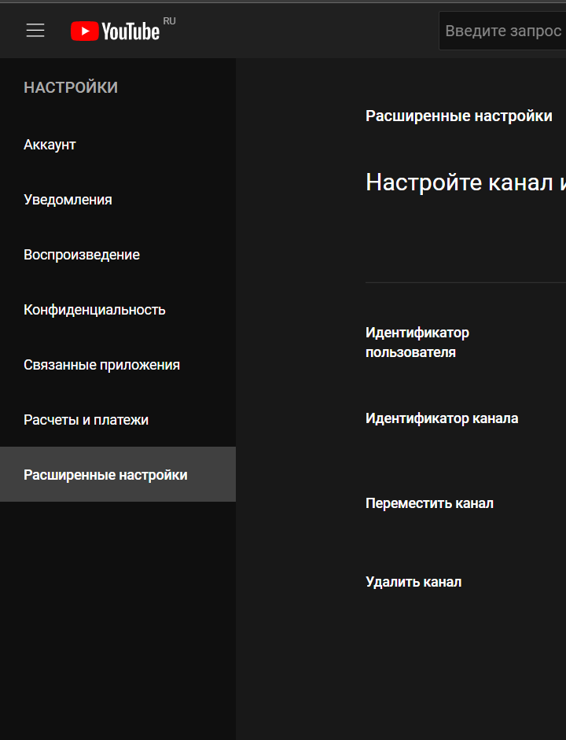

# **YouTube**
## **Содержание**
* Обзор меню
* Основные разделы меню
* Дополнительное меню
* Подписки
* Другие возможности
* Прочее

## **Обзор меню**
### Видеохостинг YouTube постоянно меняется, добавляя новые и убирая устаревшие функции. Рассмотрим, что и как работает.
### Если нажать на иконку меню, обозначенную тремя параллельными линиями, то можно заметить следующее:
* Главная   
* Навигатор
* Shorts
* Подписки

### *Пример меню*

### У каждого раздела есть соответствующая ему иконка для лучшего визуального восприятия.
### При повторном нажатии на иконку меню, можно оставить только основные разделы, упомянутые выше. К ним прибавляется ещё один раздел с собственным обозначением – «Библиотека». При выборе данного стиля рекомендованные видео занимают больше места на экранах пользователя. 

## **Основные разделы меню**
### 1. «Главная». При нажатии на иконку, сайт обновляется и предлагает новые рекомендованные видео, а также популярные теги, по которым можно найти видеоролики на соответствующую тему.
### 
### *Дата обращения 04.04.22, 14:57*
### 
### *Дата обращения 04.04.22, 14:58*
### 2. «Навигатор». Создан для упрощенного поиска пользователем. В данный раздел входят 6 подразделов:
* В тренде
* Музыка
* Фильмы
* Трансляции
* Видеоигры
* Спорт

### При нажатии на иконку появляется главная страница, соответствующая тематики определенного подраздела.

#### 2.1. «В тренде» состоит из 4-х сегментов:
* Новости
* Музыка
* Видеоигры
* Фильмы
#### У каждого из сегментов индивидуальная страница, отображающая наиболее популярные видеоролики в заданной сфере.

#### 2.2 Подраздел «Музыка» включает в себя:
* Главное
* Сообщество 
* О канале
#### На главной странице подраздела можно также найти предложенные категории такие как: «Топ-хиты», «Новая музыка», «Лучшее для меломанов» и т.д.

#### 2.3. «Фильмы» доступны только при дополнительной подписки или при покупки и/или проката фильма. Всего сегментов два:
* Каталог
* Покупки

#### 2.4. При нажатии на иконку «Трансляции» в разделе «Главная» можно найти как самые актуальные, предстоящие или находящиеся в прямом эфире. «О канале» даёт краткое описание и дату регистрации.

#### 2.5. В подразделе «Видеоигры» нет сегментов, но есть категории для быстрого и удобного поиска:
### «Лучшие игровые трансляции», «Рекомендации», «Популярные видео» и т.д.

#### 2.6.Последним подразделом является «Спорт». Он также, как и предыдущий не разделен на сегменты, а только на категории: «В эфире», «Лучшие моменты», «В тренде» и т.д.

### 3.	При нажатии на иконку «Shorts» пользователю представляются короткие видеоролики продолжительностью меньше минуты и разной направленности. Справа от видео расположено 5 кнопок. Троеточие представляет собой меню с тремя функциями: посмотреть описание видео, пожаловаться на контент, отправить отзыв. 

### Следующие две кнопки помогают оценить представленный материал в положительную или отрицательную сторону. Есть кнопка «Комментировать», где можно прочитать мнение других пользователей или оставить своё. «Поделиться» помогает как отправить ссылку, так и переслать видео через мессенджеры.
### Существуют ещё две кнопки в виде стрелок «вверх» ↑ и «вниз» ↓ для удобного переключения между видео.

### 4. 4.	Раздел «Подписки» представляет собой список видео, рассортированных по дате добавления. В правом верхнем углу есть две иконки, обозначенные как «Управление подписками».  Их графические обозначения показывают, как будут представлены видео на экране пользователя. При нажатии на левую иконку в виде квадратов, расположенных в два ряда, видео у пользователя сортируются как сетка. Если выбрать правую иконку видео в виде маркированного списка, то видео будут представлены аналогичным образом. 
 
### *Стиль сетка*

### *Стиль список*

### Дополнительный раздел – «Библиотека». Он подразделен на четыре категории:
* История
* Смотреть позже
* Плейлисты
* Понравившиеся
### У каждой категории в правом верхнем углу экрана есть кнопка «ещё», нажав на неё пользователь переходит в соответствующий раздел, где представлено больше видео, исходя из просмотренного пользователем. 
### В правом верхнем углу экрана можно найти информацию о текущих подписках, загруженных видео и отметках «мне нравится». Подписи не является интерактивными, не содержат гиперссылок и предоставлены только в качестве ознакомления.

## **Дополнительное меню**
### Дополнительными разделами являются следующие:
* Библиотека
* История
* Ваши видео
* Смотреть позже
* Понравившиеся

### *Примечание:* раздел «Библиотека» был описан как часть дополнительного раздела в основном меню.

### 1.	Раздел «История» представляет собой список видео, которые были просмотрены пользователем ранее. Они упорядочены по дате просмотра от недавно просмотренных до самых первых.

### Справа от списка видео есть панель для поиска в разделе. Вводя ключевые слова из названия искомого видео, пользователь получает отсортированный список по дате просмотра, что экономит время и трудозатраты.

### В подразделе «Тип данных» отображается непосредственно сама история, если выбрана эта категория или «Записи в сообществе». Последняя категория показывает оставленные участие в сообществе канала, например – участие в опросах.
### Ниже представлены три функции:
* Очистить историю просмотра
* Не сохранять историю просмотра
* Посмотреть историю на странице «Мои действия»
### Выбирая последнее, подразделенное на ещё три, пользователь проходит по гиперссылке на свой google-аккаунт. 

### «Просмотр и поиск» даёт информацию о совершенных пользователем действиях о заданных ключевых словах в строке поиска.
### В функции «Комментарии» можно увидеть оставленные пользователем комментарии с указанием даты и видео.
### «Чат» показывает сообщения, оставленные во время проведения трансляции.

### 2. При нажатии на иконку "Ваши видео", пользователь переходит на отдельный сайт YouTube Studio. На платформе расположены интсрументы, подходящие для создания и редактирования видео.

### 3.	Переходя в раздел «Смотреть позже» пользователь получает доступ к видео, которые он отметил ранее. Отображаются такие параметры как: количество видео, сколько людей посмотрело, если доступ не ограничен и дата обновления. 
### Над аватаром пользователя, слева от списка видео, находятся две кнопки. Одна из них, скрещенные стрелки, с подписью «Перемешать» включает видео из списка в случайном порядке. 
### Другая в виде троеточия отображает такие функции как:
* Добавление видео
* Показать недоступные видео
* Удалить просмотренные видео

### При нажатии на кнопку «добавление видео», перед пользователем открывается диалоговое окно:

### Пользователь может добавить видео в плейлист «Смотреть позже» как с помощью введения ключевых слов в строке поиска, так и с помощью скопированной ссылки. Если у пользователя есть собственные видеоролики на канале, то он может добавить их посредством третий категории «Ваши видео на YouTube».
### Пользователю также предлагается упорядочить видео по нескольким параметрам:
* Дата добавления (сначала новые или старые).
* По популярности.
* Дата публикации (сначала новые или старые).

### Около каждого видео есть меню, в виде вертикального троеточия, которое позволяет совершить ряд действий на усмотрение пользователя:
* Добавить в очередь, значит видео будет проигрываться следующим.
* Добавить в плейлист, если у пользователя их несколько, тогда предлагается выбор среди них или создать новый.
* Удалить из плейлиста «Смотреть позже».
* Переместить вверх.
* Переместить вниз.

### 4.	Раздел «Понравившиеся» представляет собой плейлист, состоящий из видео, которые нравятся пользователю. Также, как и в предыдущем раздел содержится информация для ознакомления: количество видео, сколько людей посмотрело, если доступ не ограничен и дата обновления. 
### Аналогично присутствуют две кнопки над аватаром пользователя. Первая - «Перемешать», вторая в виде троеточия ограничилась только одной функцией – показать недоступные видео.
### Меню, вызываемое наведением курсора на интересующее видео, включает в себя следующие действия:
* Добавить в очередь.
* «Смотреть позже».
* Добавить в плейлист.
* Удалить из понравившихся

## **Подписки**
### В данном разделе пользователь может более детально разобраться с подписками на интересующие его каналы. 

### При переходе на главную страницу канала можно заметить 6 подразделов и строку поиска.Разберём подробнее подразделы:
* «Главная». В данном подразделе представлены видео для ознакомления, рассортированные по дате обновления. Если есть прямые трансляции, то на первом месте то видео, у которого больше зрителей.
* «Видео». В левом верхнем углу есть надпись «Загрузки» и, если рядом с ней есть данный символ √, то видео можно рассортировать по таким параметрам как: все видео, загрузки или в эфире. В правом верхем углу есть другая кнопка с надписью « Упорядочить». Для пользователя предлагается три опции рассотрировки видео: самые популярные, дата добавления:  сначала старые, дата добавления: сначала новые.
* «Плейлисты». Разрабатывабтся создателем(и) канала и подписываются ими же. Их также можно упорядачить по: дате добавления: сначала новые и дате обновления. Каждый плейлист показывает сколько видео в нём содержится.
* «Сообщество». Отображаются новости и обновления канала. Под каждым постом  пользователи могут прокомментировать и оценить запись, если создатель канал не вводил ограничения. При наведении курсора на пост, справа от записи появлеся вертикальное троеточие, при нажатии на иконку появляется кнопка «Пожаловаться», если публикуемой контент не соответсвует заявленному и нарушает один из критериев:

  * Нежелательная реклама или спам.
  * Порнография или откровенные сексуальные сцены.
  * Жестокое обращение с детьми.
  * Дискриминационные высказывания или натуралистический контент.
  * Пропаганда терроризма
  * Домогательства или издевательства
  * Самоубийство или членовредительство
  * Ложная информация

* «Каналы». Представлены сопутствующие каналы создателя.
* «О канале». Содержится краткое описание канала, статистика с указанием даты регистрации и количеством просмотров и две небольшие категории. В «Дополнительно» указана страна создателя и адрес электронной почты для коммерческих запросов. Во второй категории «Ссылки» отображены мессенджеры и другие платформы, связанные с каналом.
### В правом верхнем углу страницы канала можно заметить иконку колокольчика. При нажатии на неё можно выбрать тип оповещений:
* все;
* на основе предпочтений;
* никакие.

### По умолчанию оповещения установлены на иконке «На основе предпочтений», в таком случае пользователь будет получать уведомления о рекомендованном контенте.

## **Другие возможности**
### Снизу от сегмента «Подписки» можно найти небольшое меню с названием «Другие возможности». Меню включает в себя 4 из 6 подразделов, которые можно найти в основном меню в разделе «Навигатор». Содержание подразделов ничем не отличается от описанного в сегменте «Основное меню».

## **Прочее**
### Под сегментом «Другие возможности» находятся вспомогательные функции:

### 1. Настройки
### Раздел «Настройки» содержит в себе 7 подразделов:
* Аккаунт
* Уведомления
* Воспроизведение
* Конфиденциальность
* Связанные приложения
* Расчеты и платежи
* Расширенные настройки

### 1.1. Аккаунт. В данном подразделе можно дополнить сведениями о себе, создать собственный канал и оформить подписку YouTube Premium. Категория «Мой канал» отвечает за создание, функционирование и настройки канала, созданного пользователем. Нажав на выделенные функции сайт переправляет пользователя на страницы, способные удовлетворить запросы. В категории «Ваш аккаунт» возможно как настроить google аккаунт, который привязан к сайту YouTube, так и оформить подписку. В обоих случаях, пользователь переправляется на соответствующие страницы.

### 1.2. Уведомления. Подраздел отвечает за включение и выключение оповещений, а также настраиваемые рассылки или новости. Пользователь сам настраивает удобные для него параметры. Возможен выбор языка для рассылки по электронной почте.

### 1.3. Воспроизведение. Пользователь задает параметры воспроизведения видео в поддерживаемом браузере. Представлены три параметра: подсказки (в видео будут проигрываться комментарии, оставленные автором), субтитры, воспроизведение в ленте (будет доступен предварительный просмотр на главной странице).

### 1.4. Конфиденциальность. Подраздел отвечает за плейлисты и подписки, а именно видна ли информация о сохраненных видео другим пользователям. Категория «реклама на YouTube» несёт только ознакомительный характер.

### 1.5. Связанные приложения. В этом подразделе пользователь может связать канал YouTube c аккаунтами в других сервисах.  Справа от представленных платформ есть кнопка «связать» с помощью которой пользователь можно осуществить предложенное действие.

### 1.6. Расчеты и платежи. Для выполнения оплаты пользователю необходимо подтвердить действия через google-аккаунт при нажатии на выделенное гиперссылкой слово «подробнее…».

### 1.7.Расширенные настройки. Идентификаторы пользователя и канала носят ознакомительный характер, пользователь может скопировать уникальные данные. Также доступны такие функции как «переместить канал», предлагается установить связь канала пользователя с брендом и «удалить канал», после удаления google-аккаунта останется доступным.

### 2. Жалобы
### Переходя в раздел «Жалобы», пользователь переходит на главную и единственную страницу. Для того, чтобы оставить жалобу необходимо перейти по гиперссылке, указанной как «здесь». Пользователь попадает на другой сайт в справочный раздел google, где находится инструкция как это осуществить.
### Если пользователь уже ранее оставлял жалобы, то они будут отображаться в данном разделе. Существует возможность рассортировки по таким промежуткам времени как:
* За последний месяц
* За последний год
* Все

### 3. Справка
### При нажатии на раздел «Справка» пользователь не переходит на другую страницу, взамен на главной странице YouTube справа появляется поисковое окно. Пользователь может как самостоятельно ввести в поисковую строку необходимые ключевые слова для запроса, так и найти нужное среди уже имеющихся часто задаваемых вопросов. Нажав на предложенную статью, пользователь получает подробную пошаговую инструкцию по решению своей проблемы. Часто в таких инструкциях есть сопровождающие видео для более быстрого понимания алгоритма действий.  У пользователя также есть возможность просмотреть все предложенные статьи, нажав на гиперссылку «Все статьи». В данном случае платформа перенаправит пользователя в справочный центр google, открыв ссылку в новой вкладке. 
 

### 4. Отправить отзыв
### Для того, чтобы оставить отзыв, пользователю необходимо нажать на соответствующую кнопку в разделе меню. На экране пользователя появляется окно с местом для написания текста. Рекомендуется не использовать в отзыве персональной информации. Если для получения ответа на вопрос пользователю требуется указать личные данные или, если вопрос правого характера, то предлагается посетить справочный центр сайта или обратиться в службу поддержки. В качестве приложения к написанному отзыву, пользователю предлагается прикрепить скриншот, сделанный с помощью предоставленной функции. Предоставление скриншота опционально.

